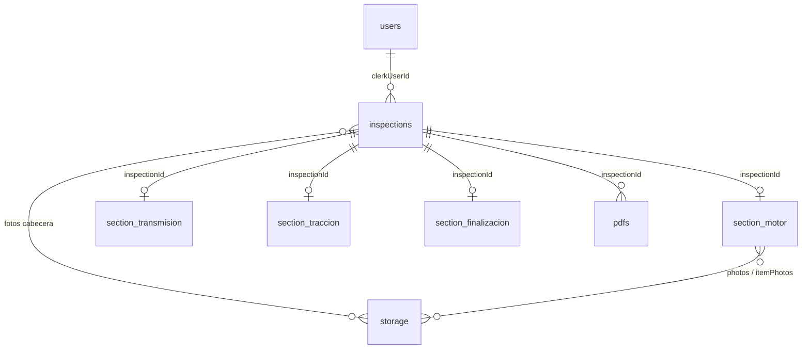

# Guía para video — Base de datos Smartcheck (Convex)

> **Uso:** leé este documento mientras grabás o presentás el video para Esteban.  
> Está pensado como guion técnico pero en lenguaje claro: qué es Convex, qué datos guardamos y cómo fluyen.

---

## 1. Introducción (30 segundos)

**Smartcheck** es una PWA para que técnicos hagan inspecciones de vehículos en campo: datos del cliente, fotos, 18 secciones del informe y PDF final.

**La base de datos vive en Convex**, un backend en la nube que reemplaza el modelo clásico de “API + PostgreSQL + servidor propio”. En Smartcheck:

- La app (Next.js) habla **directo** con Convex.
- Los usuarios se autentican con **Clerk**.
- Las fotos van a **Convex Storage** (archivos binarios separados de las tablas).
- Producción: deployment **`curious-whale-692`** → `https://curious-whale-692.convex.cloud`

---

## 2. ¿Qué es Convex? (2–3 minutos)

### En una frase
**Convex es base de datos + funciones de servidor + almacenamiento de archivos + sincronización en tiempo real**, todo en un solo servicio administrado.

### Conceptos clave (para el video)

| Concepto | Qué es en la práctica |
|----------|------------------------|
| **Tablas (tables)** | Como hojas de Excel tipadas: cada fila es un documento JSON con schema fijo. |
| **Schema** | Contrato en `convex/schema.ts`: qué campos existen, tipos y valores permitidos. |
| **Queries** | Funciones de **solo lectura** (listar inspecciones, traer una sección). |
| **Mutations** | Funciones de **escritura** (crear borrador, guardar sección, subir metadata de foto). |
| **Storage (`_storage`)** | Bucket de archivos (fotos del vehículo, PDFs). En tablas solo guardamos el **ID** del archivo. |
| **Índices** | Permiten buscar rápido (ej. inspecciones por `clerkUserId` o por `clientId`). |
| **Tiempo real** | Si dos pantallas leen lo mismo, Convex puede actualizarlas cuando cambian los datos. |

### Qué **no** tenemos que mantener nosotros
- Servidor Node/Express propio para la BD.
- Migraciones SQL manuales en un Postgres.
- WebSockets a mano para “refrescar” la UI.

### Analogía simple
Imaginá **Google Sheets con reglas estrictas + botones que ejecutan código seguro** cada vez que alguien guarda. Eso es Convex: datos + lógica + permisos en el mismo lugar.

---

## 3. Arquitectura general (1–2 minutos)

```
┌─────────────────┐     JWT Clerk      ┌─────────────────┐
│  PWA / Next.js  │ ◄────────────────► │     Clerk       │
│  (técnico/admin)│                    │  (login/usuarios)│
└────────┬────────┘                    └────────┬────────┘
         │ queries / mutations                   │ webhook
         ▼                                       ▼
┌─────────────────────────────────────────────────────────┐
│                      CONVEX                              │
│  ┌──────────┐  ┌──────────────┐  ┌──────────────────┐  │
│  │ Tablas   │  │ Funciones    │  │ Storage (fotos)  │  │
│  │ users    │  │ inspections  │  │ PDFs             │  │
│  │ inspect. │  │ sections     │  │                  │  │
│  │ section_*│  │ pdfs, admin  │  │                  │  │
│  └──────────┘  └──────────────┘  └──────────────────┘  │
└──────────────────────────┬──────────────────────────────┘
                           │ webhook (opcional)
                           ▼
                    n8n / Manychat / automatizaciones
```

**Offline (PWA):** mientras no hay red, el borrador vive en **IndexedDB del navegador**. Al volver internet, una cola de sync sube cabecera, secciones y fotos a Convex (mismo modelo de datos).

---

## 4. Mapa de tablas — qué datos tenemos

### Resumen rápido

| Tabla | Rol |
|-------|-----|
| `users` | Usuarios de la app (copia de Clerk + rol) |
| `inspections` | **Cabecera** del informe (cliente, vehículo, fotos, estado, BI) |
| `section_motor` … `section_finalizacion` | **18 tablas**, una por sección del informe |
| `pdfs` | Registro de PDFs generados (admin) |
| `_storage` | Archivos binarios (no es tabla “nuestra”, es de Convex) |

**Relación principal:** cada fila de `section_*` tiene `inspectionId` → apunta a **una** inspección.  
**Regla:** 1 inspección = hasta 1 fila por tabla de sección (índice `by_inspection`).

---

## 5. Tabla `users`

Sincronizada desde **Clerk** vía webhook HTTP (`/clerk-webhook`).

| Campo | Descripción |
|-------|-------------|
| `clerkId` | ID único en Clerk |
| `email`, `name`, `imageUrl` | Perfil |
| `role` | `tecnico` o `admin` |
| `approvalStatus` | `pending` / `approved` (técnicos nuevos esperan aprobación) |
| `createdAt`, `updatedAt` | Timestamps |

**Regla de negocio:** el **primer usuario** que entra al sistema queda `admin`; los demás `tecnico`.

---

## 6. Tabla `inspections` — la cabecera del informe

Aquí va todo lo que **no** es un ítem del checklist de secciones.

### Cliente y operación
- `clientName`, `clientPhone`, `clientEmail`
- `location`, `sellerType`, `sellerNote`
- `captureSource` — de dónde vino el cliente (publicidad, TikTok, referido, etc.)
- `manychatId` — integración con automatización al entregar informe

### Vehículo
- `vehicleBrand`, `vehicleModel`, `vehicleYear`
- `transmissionType` — automático/manual + 2WD/4WD
- `engineType`, `engineSpec`, `countryOfOrigin`
- `identifierType` — VIN o placa
- `vin`, `plateNumber`, `identifier`
- `mileage`, `mileageUnit` — km o millas

### Fotos de cabecera (IDs en Storage)
- Cuatro ángulos: `vehiclePhotoFront`, `SideLeft`, `SideRight`, `Rear`
- Documentos: `circulationCard`, `photoDekra`, `photoPlate`, `photoMarchamo`, `photoVinSticker`
- Campo legacy: `vehiclePhoto` (una sola foto antigua)

### Estado del informe
| `status` | Significado |
|----------|-------------|
| `draft` | En curso |
| `completed` | Todas las secciones listas |
| `pending_sync` | Listo localmente, falta subir |
| `synced` | Confirmado en nube |
| `report_delivered` | PDF entregado al cliente |

Otros: `findingsCount`, `lastSyncedAt`, `reportDeliveredAt`.

### Campos solo BI / admin (no van al PDF)
- `inspectionFee`, `outOfGamFee`, `inGam`, `totalAmountCharged`
- `biCommission`, `biVehicleCondition` (1–3)

### Identificador estable offline
- `clientId` — UUID generado en el dispositivo para URL y sync **idempotente** (mismo borrador no duplica filas)
- `clerkUserId` — técnico dueño del informe

---

## 7. Las 18 tablas de secciones

Cada sección del informe técnico = **una tabla** en Convex. Orden del flujo:

1. Motor  
2. Transmisión  
3. Eléctrico  
4. Frenos  
5. Suspensión  
6. Dirección  
7. Escape  
8. Neumáticos  
9. Combustible  
10. Electrónica  
11. Iluminación  
12. Accesorios  
13. A/C y calefacción  
14. Seguridad  
15. Carrocería  
16. Prueba de conducción  
17. **Tracción** (penúltima; ítems condicionales según 2WD / 4WD / 4x4)  
18. **Finalización** (nombre inspector, fecha/hora, comentario opcional)

### Estructura común de cada `section_*`

```text
{
  inspectionId: Id<"inspections">,
  photos?: Id<"_storage">[],           // fotos generales de la sección
  itemPhotos?: { [itemKey]: ref[] },   // fotos por ítem
  ...campos del checklist...
}
```

El **catálogo de ítems** (labels, tipos de control, orden) vive en código: `lib/constants/sectionItems.ts`.  
El **schema Convex** define qué campos puede guardar cada tabla.

---

## 8. Tipos de respuesta de los ítems

Casi todos los ítems del checklist son objetos con esta forma:

### `bien_reparacion_na` (Está bien / Atención / N/A)
```json
{ "value": "bien" | "reparacion" | "na", "observation": "texto opcional" }
```
En UI: **Está bien** = `bien`, **Atención** = `reparacion`.

### `si_no_na` (Sí / No / N/A)
```json
{ "value": "si" | "no" | "na", "observation": "texto opcional" }
```

### Select (ej. desgaste de neumáticos, tipo de tracción)
```json
{ "value": "normal" | "2wd" | "4wd" | "4x4", ... }
```

### Texto / textarea
- Texto libre: `fabricacion` en neumáticos.
- Finalización: `comentario_final` → `{ "texto": "...", "observacion": "..." }`.

### Readonly (Finalización)
- `nombre_inspector`, `fecha_hora` — se persisten al guardar la sección.

---

## 9. Cómo funciona el flujo de datos (demo en vivo)

### A. Crear inspección
1. Técnico inicia wizard en la PWA.
2. Se genera `clientId` (UUID) en el dispositivo.
3. Mutación `inspections.createOrUpdateFromDraft` → fila en `inspections` con `status: draft`.
4. Mutación `sections.ensureSectionRows` → crea **18 filas vacías** (una por tabla `section_*`) ligadas a esa inspección.

### B. Llenar secciones
1. El técnico entra a Motor, Transmisión, etc.
2. Cada “Guardar y continuar” llama `sections.upsertSection` con `{ sectionTable, data }`.
3. `data` se sanitiza (`sanitizeSectionPatch`) y hace **patch** sobre la fila existente.
4. `sections.listSectionSummaries` calcula progreso: completado / en curso / pendiente.

**Tracción (caso especial):** si eligen **2WD**, solo cuenta el ítem principal; con **4WD/4x4** se exigen los 4 ítems adicionales.

**Finalización:** completada con **nombre + fecha** guardados; el comentario es opcional.

### C. Fotos
1. El cliente sube archivo → Convex Storage devuelve `Id<"_storage">`.
2. Ese ID se guarda en `inspections.*` o en `section_*.photos` / `itemPhotos`.
3. Las queries de fotos resuelven ID → URL firmada para mostrar en la app.

### D. PDF (admin)
1. Query `pdfs.getExportPayload` arma JSON con cabecera + todas las secciones + URLs de fotos.
2. El PDF se genera en el **cliente** (`@react-pdf/renderer`).
3. Mutación registra el archivo en tabla `pdfs` y puede marcar `report_delivered`.

### E. Offline → online
1. Borrador en **IndexedDB** (inspección + secciones + cola de fotos).
2. Al reconectar: sync sube cabecera, secciones y blobs de fotos.
3. Mismo `clientId` evita duplicar inspecciones en Convex.

---

## 10. Seguridad y permisos

Autenticación: **Clerk** emite JWT; Convex valida en cada query/mutation.

| Rol | Puede |
|-----|--------|
| **tecnico** | Ver y editar **sus** inspecciones (`clerkUserId`) |
| **admin** | Ver todas, panel admin, exportar PDF, migraciones desde app |

Helpers en `convex/lib/auth.ts`:
- `requireUser`, `requireAdmin`
- `canAccessInspection`, `canAccessInspectionByClientId`

**Sin sesión** → queries devuelven `null` o error “No autorizado”.

---

## 11. Integraciones externas

| Sistema | Cómo se conecta |
|---------|-----------------|
| **Clerk** | Login + webhook → tabla `users` |
| **n8n** | Tras ciertas mutaciones se encola `n8nWebhook.deliver` (no bloquea la UI). Variable `N8N_WEBHOOK_URL`. |
| **Manychat** | Campo `manychatId` en inspección; lo usa automatización al cerrar informe |

---

## 12. Migraciones de datos

Archivo: `convex/migrations.ts`.

Patrón:
- Funciones **`Internal`** para correr desde terminal **sin** login Clerk.
- Funciones **públicas** con `requireAdmin` para la misma lógica desde la app.

Ejemplos ya usados en prod:
- Backfill de `clientId` en inspecciones legacy.
- Backfill de campos de facturación (`inGam`, `totalAmountCharged`).
- **`backfillTraccionSectionInternal`** — crea/actualiza sección Tracción con `2wd` en reportes viejos.

Comando típico:
```bash
npx convex run migrations:nombreInternal '{}' --prod
```

---

## 13. Qué mostrar en el Dashboard de Convex (demo visual)

1. **Data → inspections** — filas reales: cliente, vehículo, status.
2. Abrir una inspección → **Data → section_motor** (u otra) filtrando por `inspectionId`.
3. **Storage** — fotos subidas (miniaturas).
4. **Functions** — logs de `upsertSection`, `createOrUpdateFromDraft`.
5. **Logs** — errores de sync o validación de schema.

---

## 14. Entornos

| Entorno | Uso |
|---------|-----|
| **Dev** | Desarrollo local (`npx convex dev`) |
| **Prod** | `curious-whale-692` — app en smartcheckpwa.com |

Deploy de funciones/schema:
```bash
npx convex deploy -y
```

El frontend (Vercel) usa `NEXT_PUBLIC_CONVEX_URL` apuntando al deployment correcto.

---

## 15. Diagrama de relaciones (para pantalla)



*(En la práctica hay 18 tablas `section_*`; el diagrama muestra el patrón.)*

---

## 16. Preguntas que Esteban podría hacer

**¿Por qué Convex y no Firebase / Supabase?**  
Tipado fuerte en TypeScript, funciones de servidor colocated con el schema, buen DX para apps React en tiempo real, Storage integrado.

**¿Se puede exportar todo?**  
Sí: Dashboard → export, o queries admin + descarga de Storage. Los PDFs ya son un artefacto exportable.

**¿Qué pasa si borramos una inspección?**  
Mutación `sections.discardInspection` elimina la fila de `inspections` y **todas** las `section_*` asociadas (no necesariamente los archivos en Storage de forma automática — revisar política de retención).

**¿Los reportes viejos siguen funcionando?**  
Sí. Las migraciones backfill campos nuevos (ej. Tracción con `2wd`) sin romper lectura del PDF.

**¿Cuántos documentos tenemos hoy?**  
Ver en Dashboard → Data → conteo por tabla (inspecciones, users, etc.).

---

## 17. Cierre sugerido (30 segundos)

> “En resumen: **Convex es el cerebro de Smartcheck**. Guardamos usuarios, la cabecera de cada inspección, 18 bloques de checklist con respuestas tipadas y fotos en Storage. La PWA lee y escribe en tiempo casi real, funciona offline y sincroniza cuando hay red. Todo está tipado en `schema.ts`, la lógica en funciones Convex, y el acceso controlado por roles de Clerk.”

---

## Referencias en el repo

| Archivo | Contenido |
|---------|-----------|
| `convex/schema.ts` | Definición completa de tablas |
| `convex/sections.ts` | CRUD de secciones, progreso, orden |
| `convex/inspections.ts` | Borradores, sync, listados |
| `lib/constants/sectionItems.ts` | Catálogo UI de ítems por sección |
| `convex/README.md` | Notas técnicas para desarrolladores |
| `docs/CLERK_CONVEX_AUTH.md` | Auth Clerk ↔ Convex |

---

*Última actualización: mayo 2026 — incluye sección Tracción y reglas de completado condicional.*
